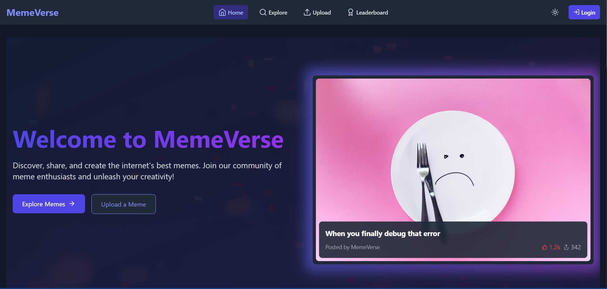

# MemeVerse 🎭

MemeVerse is a multi-page interactive meme website where users can explore, upload, and interact with memes.

## 🚀 Live Demo
[Click here to visit MemeVerse](https://67c5c29ea413c725e38acfb3--memeversebkk.netlify.app/)

[Video Recording](https://1drv.ms/v/c/68d6d0188cb1a544/EUlh95G1AONJiq9pRFH8MWABjkDAu731H-IGYl67KdqpRA?e=iZfoAo)

## 🛠️ Tech Stack
- **Frontend:** Next.js, React, Tailwind CSS
- **Animations:** Framer Motion / GSAP
- **State Management:** Redux Toolkit / Context API
- **Storage:** Local Storage / IndexedDB
- **API Handling:** Meme APIs (Imgflip, Meme Generator API)
- **Deployment:** Netlify

## 📌 Features
✅ Trending Meme Explorer (API-based)  
✅ Upload & Generate Memes  
✅ Like, Comment, and Share Memes  
✅ User Profile with Meme Collections  
✅ Leaderboard for Top Memes  
✅ Dark Mode Support  
✅ Smooth Animations & Transitions  

## 📷 Screenshots
### 🔹 Homepage  
  

### 🔹 Meme Upload  
  

## 🛠️ How to Run Locally
```sh
git clone https://github.com/i-am-bharathkumar/MemeVerse.git
cd MemeVerse
npm install
npm run dev
🔧 Deployment

```
## 🔧 Deployment
MemeVerse is deployed on Netlify. To deploy your own version:
1. Fork the repository.
2. Push your changes to GitHub.
3. Link the repository to Netlify.
4. Deploy with default settings.

👤 Author

- **Bharath Kumar -** GitHub
